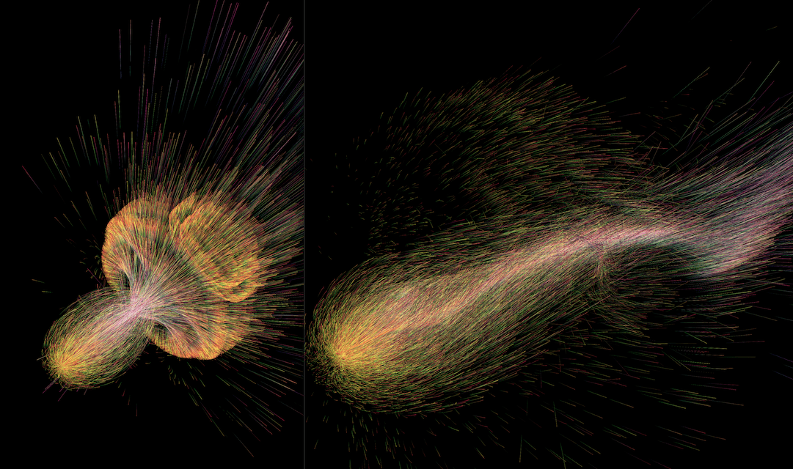

# `gl-gpgpu`

[](https://epok.tech/gl-gpgpu "GPGPU demo, particles with `regl`")

[GPGPU state-stepping](#gpgpu-state-stepping) - declaratively maps optimal draw passes, shaders, `GL` resources, inputs, outputs - lets you focus on your logic, [BYO-renderer](#byo-renderer).

## Warning: Documentation Work-in-Progress

Note that the [comments and _API_ documentation](https://epok.tech/gl-gpgpu/api) are currently still work-in-progress and may differ from the code; but the code is in working order.

## Installation

Install from [`npm`](https://www.npmjs.com/package/@epok.tech/gl-gpgpu) using:
```bash
npm install @epok.tech/gl-gpgpu
```
or:
```bash
yarn add @epok.tech/gl-gpgpu
```

## Usage

[See the demo](https://epok.tech/gl-gpgpu) and [its source code](https://github.com/keeffEoghan/gl-gpgpu/tree/master/demo/particles-regl) or [video](https://youtu.be/ddt3YA2J1ys) - below is shown a [partial example of GPGPU logic setup](#partial-example), and a [diagram of the project source code](#diagram).

[See the _API_ documentation](https://epok.tech/gl-gpgpu/api) for a fuller guide.

The code can be imported according to format specified as:
- [`CommonJS`](https://en.wikipedia.org/wiki/CommonJS), for `require`, in `cjs/`; e.g: `const { mapStep } = require('@epok.tech/gl-gpgpu/cjs/maps')`.
- [`ES` modules](https://developer.mozilla.org/en-US/docs/Web/JavaScript/Guide/Modules), for `import`, in `esm/`; e.g: `import { toStep } from '@epok.tech/gl-gpgpu/esm/step'`.
- Source code, for compiling with your own tools, in `src/`; e.g: `#pragma glslify: indexUV = require(@epok.tech/gl-gpgpu/src/lookup/index-uv)`.
- Demo code, for the browser, in `demo/`.

If your tools support [`Node` conditional exports](https://nodejs.org/docs/latest-v16.x/api/packages.html#conditional-exports), they should automatically handle importing code built for the import format used, for shorter paths:
- `CommonJS` when `require` is used; e.g: `const { mapStep } = require('@epok.tech/gl-gpgpu/maps')`.
- `ES` modules when `import` is used; e.g: `import { toStep } from '@epok.tech/gl-gpgpu/step'`.

## GPGPU State-Stepping

[GPGPU (General-Purpose Graphics Processing Unit)](https://en.wikipedia.org/wiki/General-purpose_computing_on_graphics_processing_units) methods typically use textures as 2D (or 3D) memory buffers to perform arbitrary computation on the highly-parallel GPU in shaders.

This involves reading existing states from past buffers, writing new states into the next buffers, and keeping track of the mappings of each piece of data in memory.

When the variety of capabilities across myriad devices also comes into play, managing and mapping logic optimally across the available resources on each platform quickly becomes an arduous plumbing task - `gl-gpgpu` aims to handle all this work for you.

Given a simple description of your logic and the platform's capabilities, `gl-gpgpu` creates [easily-customisable](#customisable-components) mappings and resources which allow your logic to run optimally:
- Logic is declaratively described as state values, and how new states derive from past states.
- Resources are given from the `GL` _API_ or library you use, making best use of each platform's capabilities to run your logic in as few passes and lookups as possible.

You are left free to focus on your logic, using `gl-gpgpu` macro flags and shader inputs and outputs (all safely and customisably namespaced), which allow you to easily:
- Split your code into separate concerns, executed for you in as few passes as possible.
- Look up and store states, rearranged for you into as few reads and writes as possible.

The `gl-gpgpu` mappings make a good, flexible base upon which to build complex and expressive GPGPU processes and abstractions, without getting mired in low-level resource management.

## BYO-Renderer

_Bring Your Own Renderer_ to use with `gl-gpgpu`, which can hook into any given `GL` renderer _API_ for easy compatibility.

To handle resource creation and rendering, pass an _API_ object for the needed hooks - parameters match the functional [`regl` _API_](https://github.com/regl-project/regl/), but you may mix in whatever tools you like by providing hook functions which provide compatible responses.

Ample descriptive metadata and information are provided to your hooks, while assumptions or alterations of their responses are avoided - so you can connect `gl-gpgpu` to the underlying graphics implementation however you wish.

## Customisable Components

All `gl-gpgpu` modules may be used in the given main process structure, or imported and used piecemeal, or overridden via the state properties.

Many configurations and hooks are provided into each part of the process.

This offers a deeply-customisable _API_, with few constraints, assumptions, or opinions of how to structure your code.

## Constant or Arbitrary Lookups

Choose to use distinct data textures for each part of state, or merge all states into one data texture upon each pass - depending on whether you want to look up states arbitrarily or by constant expressions (respectively), and platform capabilities and performance considerations.

## GL Versions

This technique is best-suited to `WebGL1`.

It's compatible with `WebGL2` too, including the `sampler3D` and `sampler2DArray` types, as well as the usual `sampler2D` - however, [transform-feedback handles similar features natively](https://webgl2fundamentals.org/webgl/lessons/webgl-gpgpu.html#first-example-particles) using `buffer`s rather than `texture`s, a better option in most cases - so it's usually better to check the `GL` version to use either a `gl-gpgpu` or a `WebGL2` transform-feedback implementation.

It may also be compatible with other `GL` implementations via given _API_ hooks.

## Partial Example

A partial example of GPGPU logic setup - [see above for a more complete example](#usage).

`JavaScript` setup `index.js`:

```javascript
// The main `gl-gpgpu` module.
import gpgpu from '@epok.tech/gl-gpgpu';

// Import a renderer API to handle `gl-gpgpu` hooks - see `./src/api.js`.
import api from '...';

// Import the step logic fragment shader, shown below.
import frag from 'step.frag.glsl';

// The main `gl-gpgpu` state.
const state = gpgpu(api, {
  // How many steps of state to track.
  steps: 3,
  // Logic given as state `values`, `gl-gpgpu` maps optimal inputs and outputs.
  maps: {
    // How many state `values` (channels) are tracked independently of others.
    // The order here is the order used in the shaders and generated macros, but
    // for optimal lookups may be `packed` into channels/textures/passes
    // differently.
    values: [
      // Position value, uses 3 channels.
      3,
      // Motion value, uses 3 channels.
      3,
      // Life value, uses 1 channel.
      1
    ],
    // Map how next output `values` derive from any past input `values`.
    // Top-level `array` any next output `values` by index.
    derives: [
      // Next `position` state `values` derive from past state `values`:
      [
        // `position`, 2nd `step` past.
        { value: 1, step: 1 },
        // `position`, 1st `step` past.
        0,
        // `motion`, 1st `step` past.
        1,
        // `life`, 1st `step` past.
        2
      ],
      // Next `motion` state `values` derive from past state `values`:
      [
        // `motion`, 1st `step` past.
        1,
        // `life`, 1st `step` past.
        2,
        // `position`, 1st `step` past.
        0
      ],
      // Next `life` state `values` derive from past state `values`:
      [
        // `life`, farthest `step` past.
        { value: 1, step: 2 },
        // `life`, 1st `step` past.
        2
      ]
    ]
  },
  // How many states are bound to frame-buffer outputs at any step.
  bound: 1,
  // How many `entries` to track, here encoded as the power-of-2 size per side
  // of the data texture: `(2**scale)**2`; can also be given in other ways.
  scale: 10,
  // Data type according to platform capabilities.
  type: 'float',
  // Configure macro hooks, globally or per-shader.
  macros: {
    // No `macros` needed for the `vert` shader; all other `macros` generated.
    vert: false
  },
  // A fragment shader to compute each state step, with `gl-gpgpu` `macros`.
  // Vertex shaders can also be given.
  frag,
  // Cache in `frags` all `macros` prepended to `frag` shader per-pass.
  frags: [],
  // Custom `uniforms` to be passed to shaders, with those `gl-gpgpu` mixes in.
  uniforms: {}
});

// Output of this example test:

const s = JSON.stringify;

// How `values` are `packed` to fit texture channels efficiently.
// `values` (numbers of channels used together):
s(state.maps.values) === s([3, 3, 1]);
// `packed` (if any, indexes `values`):
s(state.maps.packed) === s([0, 2, 1]);
// `textures` (indexes `values` via any `packed` or directly):
s(state.maps.textures) === s([[0, 2], [1]]);
// `valueToTexture` (indexes `textures` via `value` index):
s(state.maps.valueToTexture) === s([0, 1, 0]);

// `entries` (total number of states of `values` updated per-step):
((state.size.entries === 1048576) &&
  (state.size.entries === (2**10)**2) &&
  (state.size.entries === (2**state.scale)**2) &&
  (state.size.entries === state.size.width*state.size.height));

// Compute the next step of state.
state.step();
```

`GLSL` fragment shader logic `step.frag.glsl`:

```glsl
precision highp float;

// Setting up the macros and aliases `gl-gpgpu` provides.

// Note these `texture_${value}`/`channels_${value}`/`reads_${value}_${derive}`
// indexes correspond to the `values` indexes via `gl-gpgpu`'s `array`s
// `values`/`derives`; they're redefined here to match the structure with names.

// The texture channels each of the `values` is stored in.
#define positionChannels gpgpu_channels_0
#define motionChannels gpgpu_channels_1
#define lifeChannels gpgpu_channels_2

// Set up sampling logic via `gl-gpgpu` macro.
gpgpu_useSamples

// Set up minimal texture reads logic; only read what a value with a currently
// bound output `derives` from other `values` for its next state.
// See `derives` for how each `reads_${value}_${derive}` is indexed
// per-`derive`-per-`value`.
#ifdef output_0
  #define positionOutput gpgpu_output_0
  gpgpu_useReads_0
  #define positionReadPosition0 gpgpu_reads_0_0
  #define positionReadPosition1 gpgpu_reads_0_1
  #define positionReadMotion gpgpu_reads_0_2
  #define positionReadLife gpgpu_reads_0_3
#endif
#ifdef output_1
  #define motionOutput gpgpu_output_1
  gpgpu_useReads_1
  #define motionReadMotion gpgpu_reads_1_0
  #define motionReadLife gpgpu_reads_1_1
  #define motionReadPosition gpgpu_reads_1_2
#endif
#ifdef output_2
  #define lifeOutput gpgpu_output_2
  gpgpu_useReads_2
  #define lifeReadLifeLast gpgpu_reads_2_0
  #define lifeReadLife1 gpgpu_reads_2_1
#endif

// The main shader.

/** States from `gl-gpgpu`, merged or separate. */
#ifdef gpgpu_mergedStates
  /** States from `gl-gpgpu` in one merged `texture`. */
  uniform sampler2D gpgpu_states;
#else
  /** States from `gl-gpgpu` in separate `texture`/s. */
  uniform sampler2D gpgpu_states[gpgpu_stepsPast*gpgpu_textures];
#endif

/** Current step from `gl-gpgpu`; needed for `tapStates` or `tapStatesBy`. */
uniform float gpgpu_stepNow;

// Any custom input logic...

void main() {
  /** Sample the desired state values - creates the `gpgpu_data` `array`. */
  gpgpu_tapState(uv)

  // Read values.

  #ifdef positionOutput
    vec3 position0 = gpgpu_data[positionReadPosition0].positionChannels;
  #endif

  // If reads all map to the same value sample, any of them will do.
  #if defined(positionOutput) || defined(motionOutput)
    #if defined(positionOutput)
      #define readMotion positionReadMotion
      #define readPosition positionReadPosition1
    #elif defined(motionOutput)
      #define readMotion motionReadMotion
      #define readPosition motionReadPosition
    #endif

    vec3 position1 = gpgpu_data[readPosition].positionChannels;
    vec3 motion = gpgpu_data[readMotion].motionChannels;
  #endif

  // If reads all map to the same value sample, any of them will do.
  #if defined(positionOutput)
    #define readLife positionReadLife
  #elif defined(lifeOutput)
    #define readLife lifeReadLife
  #elif defined(motionOutput)
    #define readLife motionReadLife
  #endif

  float life = gpgpu_data[readLife].lifeChannels;

  #ifdef lifeOutput
    float lifeLast = gpgpu_data[lifeReadLifeLast].lifeChannels;
  #endif

  // Update and output values.
  // Note that the update/output logic components within each `#if` macro
  // block from `gpgpu` are independent modules, as the `gpgpu` macros
  // determine whether they're executed across one or more passes - they could
  // also be coded in separate files called from here, however they're coded
  // inline here for brevity, relevance, and easy access to shared variables.
  #ifdef positionOutput
    // Any custom position logic...

    // Output the next position value to its channels in the state texture.
    positionOutput = vec3();
  #endif
  #ifdef motionOutput
    // Any custom motion logic...

    // Output the next motion value to its channels in the state texture.
    motionOutput = vec3();
  #endif
  #ifdef lifeOutput
    // Any custom life logic...

    // Output the next life value to its channels in the state texture.
    lifeOutput = float();
  #endif
}
```

## Diagram


